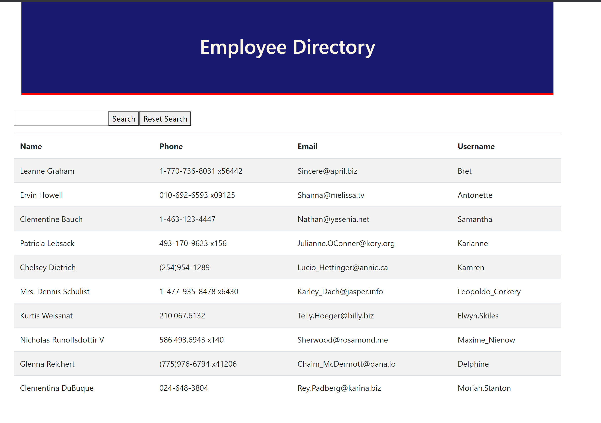
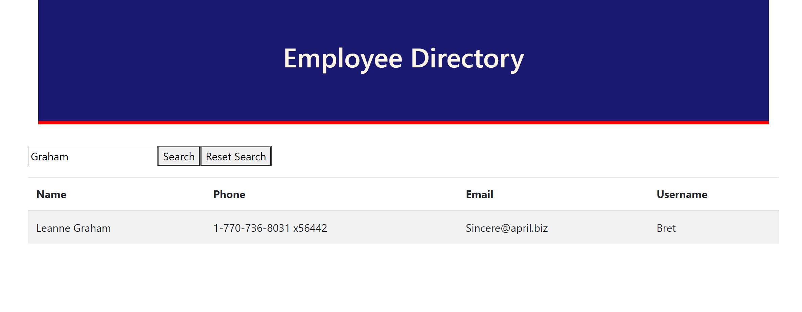

# EmployeeDirectory

## Description 
  This is a Employee Directory App built with ReactJS.  Initially it displays the full directory of the employees including name, email, username, and phone number.  There is an option to search by Name as well, filtering for one specific employee.  In addition, the user is allowed to reset the directory after the is a PWA (Progressive Web App) that allows the user to enter deposits and expenses in a budget on or offline.  If offline, the entries are stored and once back online syncs up with the database.  This full-stack app that uses HTML, CSS, JavaScript, Express, MongoDb/Mongoose, indexDB, ChartJS, and Web Manifiest and Service Workers for offline use.

  ## Table of Contents
  [1.  Installation](##Installation) 

  [2.  Instructions](##Instructions)

  [3.  App](##App)

  [4.  Future Development](##Future)
  
  [4.  Questions](##Questions)

## Installation

  1.    This project was bootstrapped with [Create React App](https://github.com/facebook/create-react-app).

## Instructions

  1.    If you want to run the project locally, fork the repository from Github.  Then in the project directory, you can run:
        ### `npm start`.  This runs the app in the development mode. Open [http://localhost:3000](http://localhost:3000) to view it in the browser.

  2.    Make sure the packages per the Package.json are installed in your project directory.
  

## App 

  
  

## Future
  
  1.  Allow one or more columns to be sortable.
  2.  Allowing the search to reset by itself instead of using the Reset Button to reset the form.
  3.  Adding pictures of the employees.
  

## Questions

  [Github Repository](https://github.com/kurt-austin/employeeTracker)

  [Employee Directory Deployed App](https://pacific-cove-73988.herokuapp.com/)

  [Contact](kurt.austin@gmail.com)

